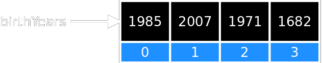
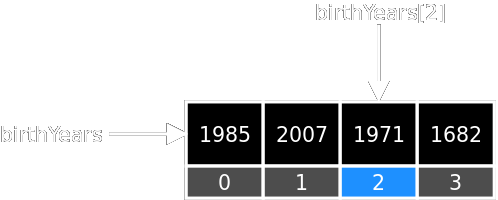
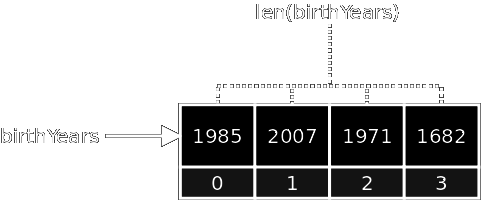

# Coding With Python

## Session 4: Lists And For Loops

===

### Workbooks

<http://tinyurl.com/hnxv6o6>

Workbook 4: Lists And For Loops

===

### From Last Session

- A **boolean** can either be `True` or `False`
- An `if` statement executes a block if the condition is `True`
- An `else` statement can be added to an `if`.  It will run if the condition is `False`.
- A `while` loop will keep running a block while the condition is `True`.
- A **block** is any code *to the right* of an `if`/`else`/`while` statement.

===

### Goals For This Session

1. Learn what a list is
2. Learn how to use the `for` loop
3. Learn how we can we leave a loop early

===

### Python Quiz

<iframe src="https://trinket.io/embed/python/827c8d6c47?outputOnly=true&amp;start=result" width="100%" height="400"
        frameborder="0" marginwidth="0" marginheight="0" allowfullscreen></iframe>

===

## Step 1: The List

### Compound Types

===

### Types So Far

- **Strings**: Sequence of characters
- **Integers**: Numbers without fractional parts
- **Floats**: Numbers with fractional parts
- **Booleans**: Either `True` or `False`

What do these have in common?

===
slideclass: img-noframe

### Simple Type

*Answer*: A variable storing something of this type
can only hold **one value**.

Also called *atomic values* (i.e. they cannot be split up).

===
slideclass: img-noframe

### Compound Types

Variables storing a compound type can hold **multiple values**.

===
slideclass: img-noframe

### List

Holds an *ordered sequence* of values.

    :::python
    birthYears = [1985, 2007, 1971, 1682]

- Each value in the list is called an **element**.
- Each element has an associated *index*, starting from 0.
- The number of elements in the list is called the **length**.

===
slideclass: img-noframe

### List Elements

To get a value of a list element, use `[]`

    :::python
    birthYears[2]      # Returns 1971

The element index always starts with 0.

===
slideclass: img-noframe

### List Elements

To change the value of a list element, use `[]` with the
assignment operator (`=`):

    :::python
    birthYears[1] = 1997

===
slideclass: img-noframe

### List Length

To get the list length (i.e. number of elements), use the `len()` function:

    :::python
    len(birthYears)     # Returns 4

===
slideclass: img-noframe

### Adding Elements To A List

To add a value to the end of the list, use the `append` method:

    :::python
    birthYears.append(2016)

This changes the structure of the list stored in `birthYears`:

===
slideclass: img-noframe

### Types Of Elements

Lists can contain any other value, including other lists:

    :::python
    items = [0, "One", True, [2, 4, 8]]

===

### Exercise 1

Write a program that has:

- The list `questions` that contain 3 or 4 quiz question
- The list `correctAnswers` that contain the answers

Print each question and answer together:

    :::python
    print(questions[0], "A:", correctAnswers[0])

Example:

    PYTHON QUIZ:
    What is used to store data in memory? A: variables
    What statement can be used for skipping code? A: if
    Which loop will run until a boolean is False? A: while
    What method is used to add something to a list? A: append

===

## Step 2: The `for` Loop

### Looping Over Values Of A List

===

### From The Last Exercise

    :::python
    print(questions[0], "A:", correctAnswers[0])
    print(questions[1], "A:", correctAnswers[1])
    print(questions[2], "A:", correctAnswers[2])
    print(questions[3], "A:", correctAnswers[3])

- What if we want to print things differently?
- What if we had 500 questions and answers?

Is there some way we could loop through each element?

===

### The `for` Loop

Takes a *list* and a variable name:

    :::python
    for currentQuestion in questions:
        print(currentQuestion)
    print("All Done")

For each element in `questions`:

- Set `currentQuestion` to that element
- Print the value of `currentQuestion`
- Go back to the top and get the next element in `questions`

Keep going until all the elements in `questions` has been printed.  Then print "All Done".

===
slideclass: img-noframe

### The `for` Loop

The statements to the right of `for` will run for
each value of `questions`.

===

### Exercise 2

Change your program to display a question, then ask the user to enter
an answer using `input()`.  Do this for each question:

    PYTHON QUIZ:
    What is used to store data in memory? <user's answer>
    What statement can be used for skipping code? <user's answer>

Store the user's answer in another list called `answers`.

- *Hint*: you will need to set `answers` to the empty list (`[]`) before using it.
- *Hint*: use the `append()` method call to add elements to a list (e.g. `answers.append()`).

===

### Checking The Answers

The next step would be to check the user's answers.
But we have a problems: `for` can only use *one* list.

    :::python
    answers = [...]
    correctAnswers = [...]

    for ???:
        if (answer == correctAnswer):
            ...

How can we loop over two?

===

### Looping Over Two Arrays Easily

- Use a variable to hold the current index
- Read the element at the given index at the loop start
- Add 1 to the index variable at the loop end

        :::python
        i = 0
        for answer in answers:
            correctAnswer = correctAnswers[i]
            if (answer == correctAnswer):
                ...
            i = i + 1

===

### Exercise 3

After asking the user to provide their answers, use a `for` loop to
check that they are correct.

- The user's answers are in the list of `answers`
- The correct answers are in the list of `correctAnswers`

For each correct answer, give the user a point.  At the end of the program, print the
user's score:

    You scored 2 out of 4

- *Hint:* Use the `len()` function to get the number of questions.

===

## Step 3: The `break` Statement

### Ending A Loop Early

===

### Letting The User Leave Early

How do we let the user leave halfway through?

    PYTHON QUIZ:
    What is used to store data in memory? variables
    What statement can be used for skipping code? exit
    You scored 2 out of 4

Need to exit the `for` loop before every question has been asked.

===

### The `break` Statement

Leaves a loop and goes to the statement just after it.

    :::python
    for question in questions:
        if (user_is_done):
            break
        print("Never be display if we break")
    print("User is done or we're out of questions")

If `user_is_done` becomes `True`, the loop ends immediately and
jumps to the second print.

Breaks also work with `while` loops.

===
slideclass: img-noframe

### The `break` Statement

Everything in the loop is skipped when a `break` is executed.

===

### `break` Statement With Two Loops

What if we have a `break` statement in two loops?

    :::python
    for first in first_items:
        for second in second_items:
            if (first == second):
                break

- The `break` will only leave the loop in directly appears in (the *inner* one).
- All the elements in `first_items` will still be processed.

===

### Exercise 4

Modify your program to let the user end the quiz whenever they enter `exit` as
an answer.

    PYTHON QUIZ:
    What is used to store data in memory? variables
    What statement can be used for skipping code? exit
    You scored 2 out of 4

The quiz should still display the user's score.

- *Hint*: you will need to add one more `if` statement

===

### Summary

- A **list** can be used to hold multiple values
- The values in a list are called **elements**, and can be accessed using it's **index**.
- The list **length** can be read using `len()`.
- The `for` loop can be used to loop through elements of a list.
- The `break` statement can be used to exit any loop.